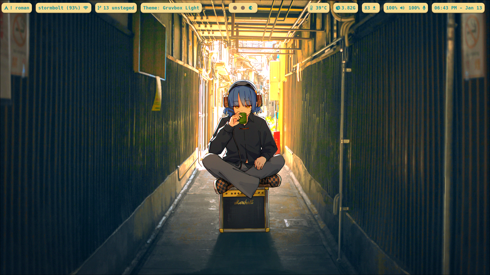
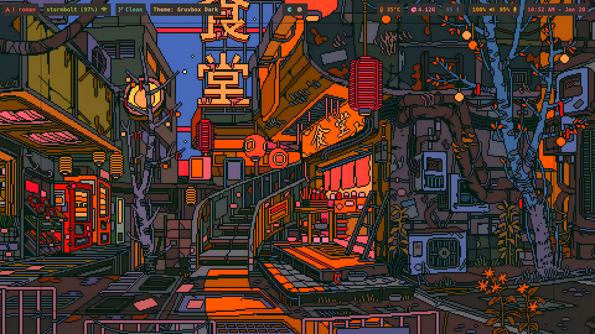
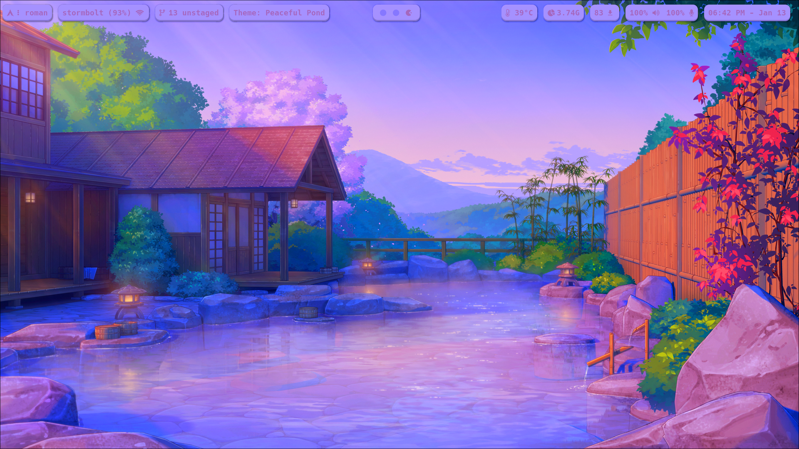
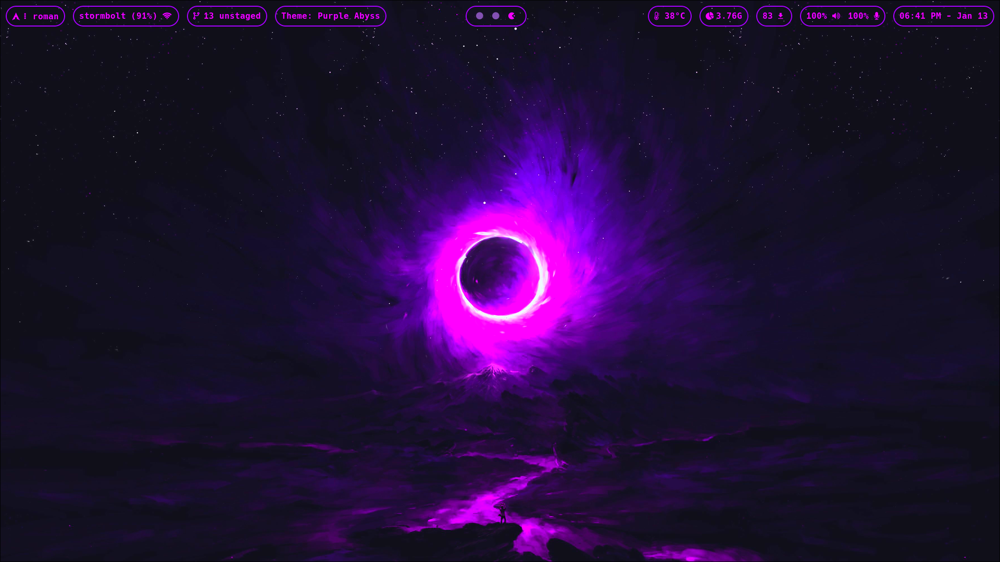
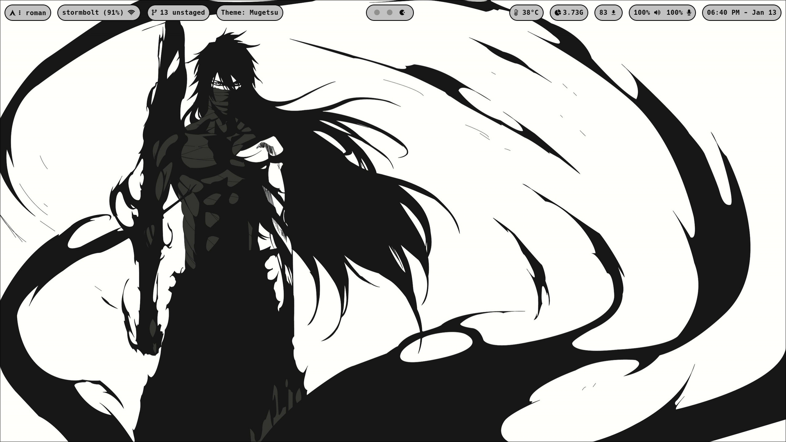
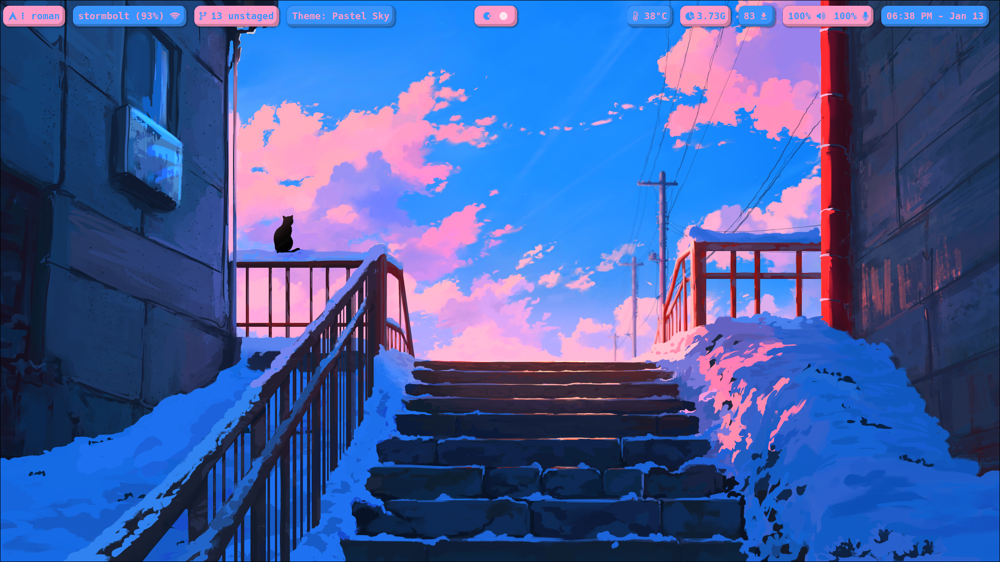
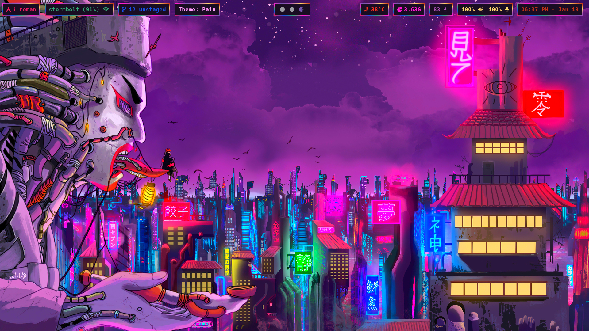
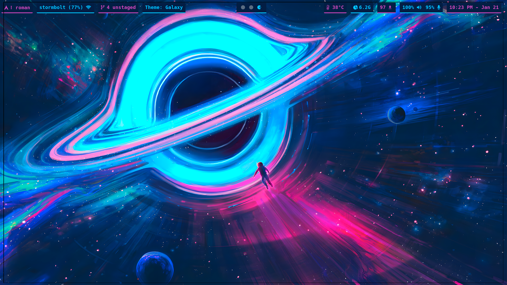

Arch Linux - Hyprland

*NOTE: If you do not use hyprshade (or shaders in general) to enhance color vibrance, do not expect the hex colors in these files to look like this on your screen(s).*

Colors grabbed using pywal16

*Gruvbox Light Theme*

*Gruvbox Dark Theme*

*Peaceful Pond Theme*

*Purple Abyss Theme*

*Mugetsu (Bleach) Theme*

*Pastel Sky Theme*

*Pain (Naruto) Theme*

*Galaxy Theme*

